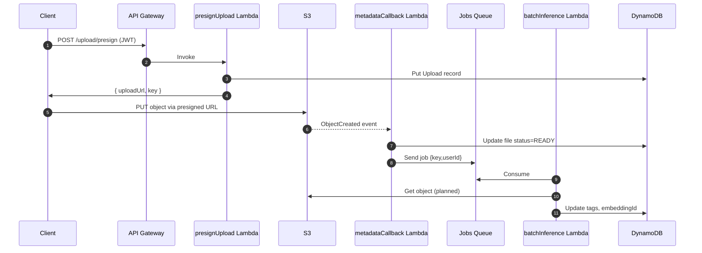
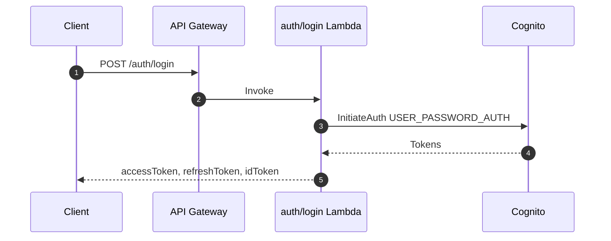
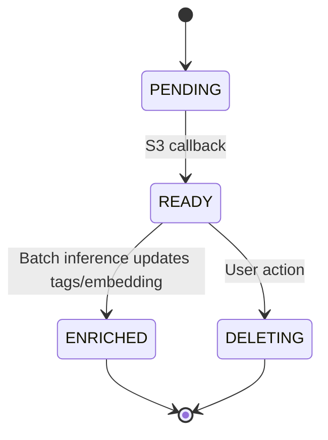

# Data Flow Documentation

## Upload Sequence

## Authentication Sequence

## File State Diagram

## Event Logging

- Lambda logs: CloudWatch (see deployment guide `backend/infra/DEPLOYMENT.md:134`).
- Client logs: `lib/core/utils/app_logger.dart:3` via `logger` package.

